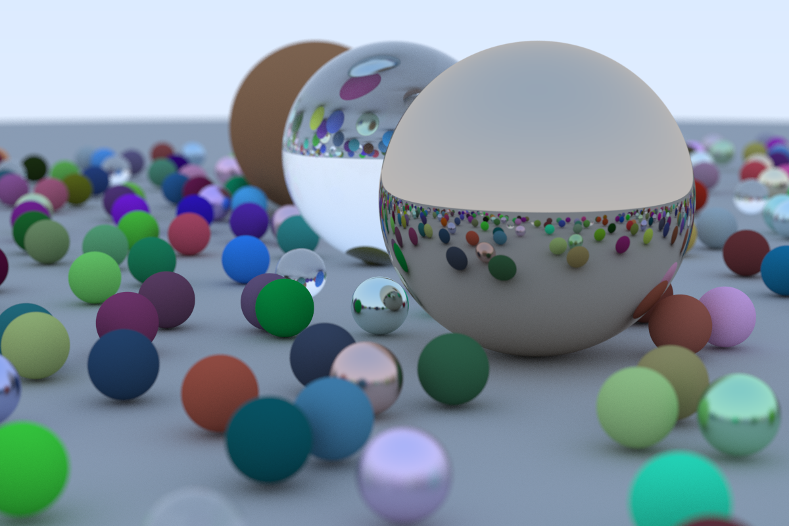

# Rust Raytracing

跟着 [Ray Tracing in One Weekend](https://raytracing.github.io/books/RayTracingInOneWeekend.html) 用 Rust 整了一个光线追踪器。

仓库中的 Commit 是根据原文中每次渲染的结果划分的，方便代码参考。

## 性能

CPU: i7-10700k 3.80GHz  
1200 * 800 分辨率图片生成，多线程总用时：10分钟19秒，单线程跑要一个小时出头。

## 运行

1. 安装 [Rust](https://www.rust-lang.org/zh-CN/tools/install)
2. （Optional）觉得慢可以换[镜像](https://www.notion.so/frankorz/Rust-b51ea3ef081f4742b9922a9be3fcc495)
3. `cargo build --release`
4. `.\target\release\raytrace.exe`

## Todo

- [x] 多线程（用 [Rayon](https://github.com/rayon-rs/rayon) 实现）
- [ ] 后续教程（Maybe）